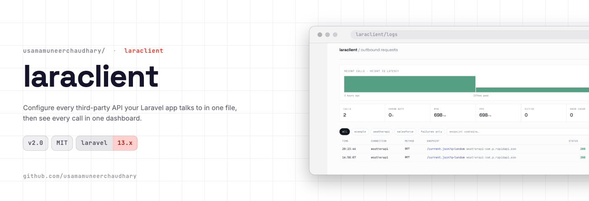

# LaraClient

Configure every third-party API your Laravel app talks to in one file, then see every call in one dashboard.

[](https://packagist.org/packages/usamamuneerchaudhary/laraclient)
[](https://packagist.org/packages/usamamuneerchaudhary/laraclient)
[](LICENSE.md)


```php
use Usamamuneerchaudhary\LaraClient\Facades\LaraClient;

$weather = LaraClient::connection('weatherapi')->get('current.json', ['q' => 'london']);
$countries = LaraClient::connection('geodb')->get('countries');

$weather->json('current.temp_c');
```

Ten APIs, ten credential schemes, ten sets of rate limits, declared once in `config/lara_client.php`
instead of scattered across ten service classes. Retries, throttling, caching, circuit breaking and
redacted request logging come with it.

---

## Requirements

| | |
|---|---|
| PHP | 8.3, 8.4, 8.5 |
| Laravel | 13.x |
| Guzzle | 7.9+ |

Running Laravel 10–12? Stay on LaraClient 1.x, or see [UPGRADE.md](UPGRADE.md).

## Installation

```bash
composer require usamamuneerchaudhary/laraclient
php artisan vendor:publish --tag=laraclient-config
php artisan migrate
```

The service provider and `LaraClient` alias are registered automatically, no `app.php` edit needed.

---

## Configuring connections

Each connection declares only what makes it different; everything else falls back to the `defaults`
block.

```php
'defaults' => [
    'timeout' => 30,
    'retry' => ['enabled' => true, 'times' => 3],
    'circuit_breaker' => ['enabled' => true],
],

'connections' => [

    'github' => [
        'base_uri' => 'https://api.github.com/',
        'auth' => ['driver' => 'bearer', 'token' => env('GITHUB_TOKEN')],
        'pagination' => ['strategy' => 'link_header'],
    ],

    'weatherapi' => [
        'base_uri' => 'https://weatherapi-com.p.rapidapi.com/',
        'auth' => ['driver' => 'header', 'name' => 'X-RapidAPI-Key', 'value' => env('RAPIDAPI_KEY')],
        'cache' => ['enabled' => true, 'ttl' => 600],
    ],

    'salesforce' => [
        'base_uri' => env('SALESFORCE_BASE_URI'),
        'auth' => [
            'driver' => 'oauth2',
            'token_url' => env('SALESFORCE_TOKEN_URL'),
            'client_id' => env('SALESFORCE_CLIENT_ID'),
            'client_secret' => env('SALESFORCE_CLIENT_SECRET'),
        ],
        'rate_limit' => ['enabled' => true, 'limit' => 100, 'window' => 60],
    ],
],
```

### Authentication drivers

| Driver | Use for                                                            |
|---|--------------------------------------------------------------------|
| `bearer` | `Authorization: Bearer <token>`                                    |
| `basic` | HTTP basic credentials                                             |
| `header` | A key in any header, `X-API-Key`, `X-RapidAPI-Key`, `apikey`       |
| `query` | A key as a query parameter                                         |
| `oauth2` | Client credentials grant, with tokens cached and refreshed for you |
| `none` | Public APIs                                                        |

OAuth2 tokens are fetched on first use, cached until shortly before expiry, and re-fetched
automatically on a 401. None of that appears in your application code.

Signing schemes of your own (HMAC, JWT assertions, mTLS headers) plug in without forking:

```php
use Usamamuneerchaudhary\LaraClient\Auth\AuthFactory;

AuthFactory::extend('hmac', fn (array $config) => new HmacAuth($config['secret']));
```

---

## Making requests

```php
LaraClient::connection('github')->get('users/{username}/repos', [
    'username' => 'usamamuneerchaudhary',   // fills the path placeholder
    'sort' => 'updated',                    // left over, so it becomes a query parameter
]);
```

Everything is fluent, and every method returns a clone, so a shared base request never leaks one
caller's settings into another's.

```php
LaraClient::connection('stripe')
    ->withHeader('Stripe-Version', '2024-06-20')
    ->timeout(5)
    ->retry(times: 4, baseDelayMs: 250)
    ->idempotent($job->uuid)
    ->throwOnError()
    ->post('charges', ['amount' => 500, 'currency' => 'gbp']);
```

<details>
<summary><strong>Full fluent API</strong></summary>

| Method | Effect |
|---|---|
| `withHeaders()` / `withHeader()` / `accept()` | Add headers |
| `withQuery()` | Add query parameters to every call |
| `withToken()` / `withBasicAuth()` / `withAuth()` / `withoutAuth()` | Override credentials |
| `timeout()` / `connectTimeout()` | Per-request timeouts |
| `retry()` / `withoutRetrying()` / `retryUnsafeMethods()` | Retry policy |
| `cacheFor()` / `fresh()` / `withoutCache()` | Response caching |
| `throttle()` / `withoutThrottling()` | Client-side rate limiting |
| `withoutCircuitBreaker()` / `withoutLogging()` | Opt out per call |
| `idempotent()` | Stamp an `Idempotency-Key` |
| `asJson()` / `asForm()` / `asMultipart()` | Body encoding |
| `sink()` | Stream the response to a file |
| `throwOnError()` | Turn 4xx/5xx into exceptions |
| `async()` | Return a promise instead of a response |

</details>

### Responses

```php
$response->json();                  // whole payload as an array
$response->json('data.0.email');    // dot-addressed
$response->collect('data');         // Illuminate Collection
$response->object();
$response->body();

$response->ok();  $response->successful();  $response->failed();
$response->clientError();  $response->serverError();
$response->notFound();  $response->unauthorized();  $response->tooManyRequests();

$response->header('X-Request-Id');
$response->fromCache();
$response->durationMs();

$response->throw();                       // RequestException on 4xx/5xx
$response->onError(fn ($r) => report($r->json('error.message')));
```

`json()` decodes once and reuses the result, and `isJson()` tells you whether the body actually
parsed, which is how you catch an HTML error page served with a 200.

---

## Resilience

### Retries

Exponential backoff with full jitter, bounded attempts, and `Retry-After` honoured in both integer
and HTTP-date form.

```php
'retry' => [
    'times' => 3,
    'base_delay' => 200,   // 200ms -> 400ms -> 800ms, randomised
    'jitter' => true,
    'statuses' => [408, 425, 429, 500, 502, 503, 504],
    'methods' => ['GET', 'HEAD', 'PUT', 'DELETE', 'OPTIONS'],
],
```

Unsafe verbs are **not** retried by default, replaying a `POST` can charge a customer twice. Opt in
with `retryUnsafeMethods()`, ideally alongside `idempotent()`.

### Rate limiting

Throttling is scoped per connection and **throws instead of sleeping**, so a queued job can hand the
work back to the queue rather than parking a worker:

```php
public function handle(): void
{
    try {
        LaraClient::connection('salesforce')->get('accounts');
    } catch (RateLimitExceededException $e) {
        $this->release($e->retryAfter);
    }
}
```

Set `'on_limit' => 'wait'` if blocking is genuinely what you want.

### Circuit breaker

After N consecutive server errors the circuit opens and requests fail fast with
`CircuitOpenException` instead of piling load onto an upstream that is already down. Once the
cooldown elapses, the next request goes through as a probe: success closes the circuit, failure
restarts the cooldown.

```php
'circuit_breaker' => ['enabled' => true, 'failure_threshold' => 5, 'cooldown' => 60],
```

`CircuitOpened` and `CircuitClosed` events fire on each transition.

---

## Caching

```php
LaraClient::connection('weatherapi')->cacheFor(600)->get('current.json', ['q' => 'london']);
```

GET and HEAD only. `Cache-Control: max-age` from the provider wins when it is shorter than your TTL,
`no-store` and `private` are respected, and entries with an `ETag` are revalidated with a conditional
request when they go stale, a 304 costs one round trip and no payload.

On a tagged cache store you can flush one integration without touching the rest of the app:

```php
Cache::tags('laraclient:weatherapi')->flush();
```

---

## Concurrency

Every request in a pool shares one curl multi handler, so they genuinely run in parallel.

```php
use Usamamuneerchaudhary\LaraClient\Pool;

$results = LaraClient::connection('github')->pool(fn (Pool $pool) => [
    $pool->as('user')->get('user'),
    $pool->as('repos')->get('user/repos'),
    $pool->as('orgs')->get('user/orgs'),
]);

$results['user']->json('login');
```

A failed request appears in place as its exception rather than taking the batch down with it.

---

## Pagination

Declare the strategy once per connection, then stop thinking about it:

```php
LaraClient::connection('github')
    ->paginate('user/repos')
    ->each(fn (array $repo) => Repo::sync($repo));
```

Backed by a `LazyCollection`, so memory stays flat across three pages or three thousand. Strategies:
`page`, `offset`, `cursor` and `link_header` (RFC 8288). Use `->chunks()` to yield whole pages for
batch inserts, and `->maxPages()` as a safety valve on endpoints that never stop.

---

## Testing

```php
LaraClient::fake([
    'github/user*' => LaraClient::response(['login' => 'usama']),
    'stripe/*'     => LaraClient::response(['error' => 'card_declined'], 402),
    '*'            => LaraClient::response([], 404),
]);

$this->post('/sync');

LaraClient::assertSentCount(1);
LaraClient::assertSent(fn ($request) => $request->isPost()
    && $request->urlIs('*charges')
    && $request->json('amount') === 500);
```

Patterns match either the full URL or the `connection/path` shorthand. An unmatched request returns
an empty 200 rather than reaching the network, a fake that silently makes real calls is worse than
no fake at all.

Pass a list to script a sequence, which is how you test retry paths:

```php
LaraClient::fake(['*' => [
    LaraClient::response([], 503),
    LaraClient::response(['ok' => true]),
]]);
```

`LaraClient::failedConnection()` simulates a transport failure for exercising backoff and circuit
breaker behaviour.

### Record and replay

Hand-written fixtures drift from the API they describe. Record the real thing once, replay it
forever:

```bash
LARACLIENT_RECORDER=record php artisan test --filter=GithubTest   # captures fixtures
LARACLIENT_RECORDER=replay php artisan test                       # hermetic, no network
```

Fixtures pass through the same redactor as the logs, so recording against a live account does not
commit your API keys.

---

## Observability

### The dashboard

`/laraclient/logs`, every outbound call, filterable by connection, endpoint and failure, with a
latency trace strip across the top: one bar per call, height is latency, colour is outcome. A cluster
of red bars is a failing window; a wall of tall bars is a slow upstream.

**The dashboard is gated.** It shows request and response bodies, so define who may see it:

```php
// AppServiceProvider::boot()
Gate::define('viewLaraClient', fn ($user) => $user->isAdmin());
```

Without a definition it denies everyone outside `local`. Auth middleware is optional, add it to
`dashboard.middleware` when you want Laravel to require a logged-in user first:

```php
// config/lara_client.php
'dashboard' => [
    'middleware' => ['web', 'auth'], // or Filament, Sanctum, etc.
],
```

### Events

```php
use Usamamuneerchaudhary\LaraClient\Events\{RequestSending, ResponseReceived, RequestFailed};
```

Plus global hooks, mirroring the shape Laravel 13 gave its own HTTP client:

```php
LaraClient::beforeSending(function ($request, $method, $url, &$options) {
    $options['headers']['X-Request-Id'] = (string) Str::uuid();
});

LaraClient::afterResponse(fn ($response) => Log::debug($response->durationMs()));
```

### Pulse

If `laravel/pulse` is installed, per-connection latency and error counts are recorded automatically.
Cache hits are excluded, counting them would flatter the numbers.

---

## Artisan commands

```bash
php artisan laraclient:check              # ping every connection; fails the build on a bad credential
php artisan laraclient:prune              # trim the logs table (schedule this daily)
php artisan laraclient:make github --spec=openapi.json
```

### Generating a typed client

`laraclient:make` turns an OpenAPI 3 document into a plain, readable PHP class you own:

```php
class GithubClient
{
    /**
     * Fetch a single part of a widget
     *
     * @param  int  $widgetId  Numeric widget id
     */
    public function getWidgetPart(int $widgetId, string $partId, array $query = []): Response
    {
        return $this->request()->get('widgets/{widgetId}/parts/{partId}', [
            'widgetId' => $widgetId, 'partId' => $partId,
        ] + $query);
    }
}
```

Path parameters become typed, ordered arguments; `operationId` collisions are de-duplicated;
`deprecated` operations are annotated. The fluent API stays reachable through `using()`:

```php
$client->using(fn ($r) => $r->timeout(2)->cacheFor(300))->listWidgets();
```

It generates methods and parameters, **not** typed response DTOs, that is on the roadmap for 2.1.

---

## Security

Everything written to the logs table or a fixture passes through the redactor first: credential
headers, sensitive body keys (recursively, including inside lists) and secrets carried in query
strings. Widen the mask for your own field names:

```php
'redact' => [
    'headers' => ['authorization', 'x-api-key', 'x-signature'],
    'body' => ['password', 'client_secret', 'card_number', 'national_id'],
],
```

If you are upgrading from 1.x, **read [UPGRADE.md](UPGRADE.md) before deploying**, v1 stored
credentials in the logs table in plaintext, and there are steps to take beyond installing this
release.

To report a vulnerability, email <hello@usamamuneer.me> rather than opening an issue.

---

## Testing the package

```bash
composer test      # phpunit
composer analyse   # phpstan
composer lint      # pint
```

## Credits

- [Usama Muneer](https://usamamuneer.me)
- [All Contributors](https://github.com/usamamuneerchaudhary/laraclient/graphs/contributors)

## License

MIT. See [LICENSE.md](LICENSE.md).
